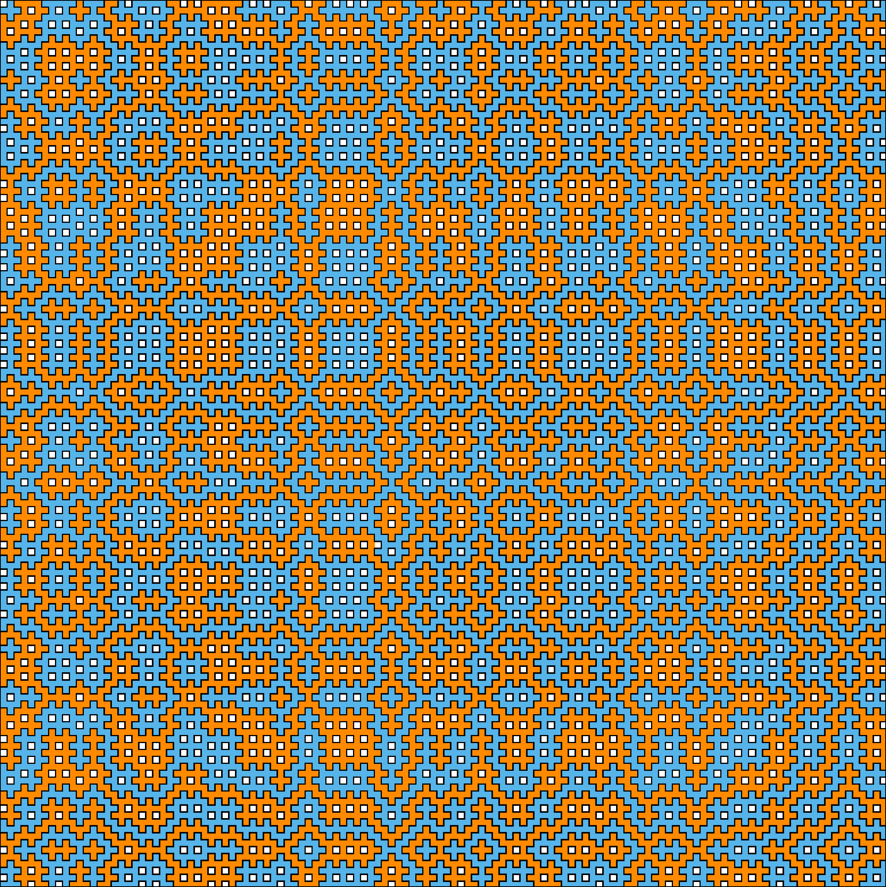
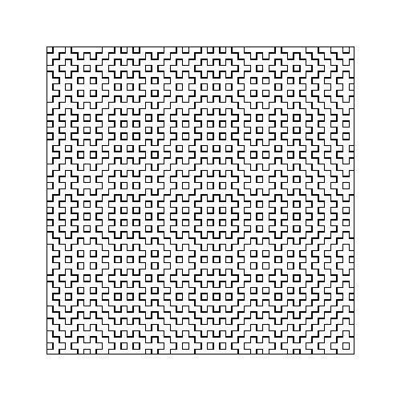
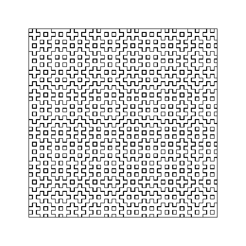
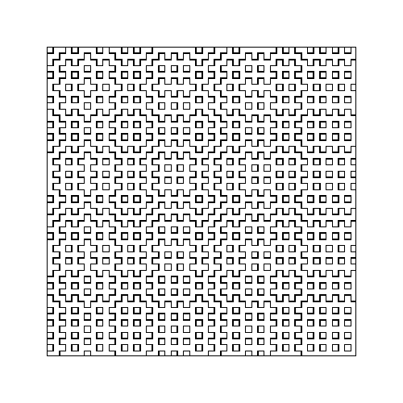
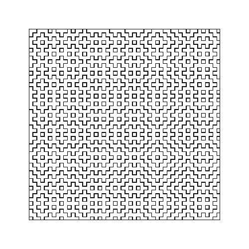

# Hitomezashi

Here I provide some code for te numerical creation of Hitomezashi art.

What is Hitomezashi? Here is an example:

According to wikipedia, Hitomezashi is particular form of Sashiko, a form of decorative reinforcement stitching,
see https://en.wikipedia.org/wiki/Sashiko and also 
https://www.romordesigns.com/journal/2018/10/18/sashiko-the-art-of-japanese-embroidery for some sewing examples.

I became aware of this thanks to Annie Perkins Math Art Challenge:
https://twitter.com/anniek_p/status/1244220881347502080
A nice video on the topic is provided by her at:
https://twitter.com/anniek_p/status/1244220881347502080

The way it works is simple. One has to simply provide a sequence of 1's and 0's (say of size `n_iter`).
Then, one plays with an (n_iter x n_iter) array, and draw little dash as follows:

## Column filling:
- If the i-th digit is a 1, start the i-th column by a dash, then a blank, then a dash, then etc. 
- If the i-th digit is a 0, start the i-th column by a blank, then a blank, then a dash, then etc. 

## Row filling:
- If the i-th digit is a 1, start the i-th row by a dash, then a blank, then a dash, then etc. 
- If the i-th digit is a 0, start the i-th row by a blank, then a blank, then a dash, then etc. 

The provided code proposed as examples to takes the "seed" sequence a random sequence (default) or the parity of the fractional part of some real number, examples including:

- `random` : 
[hitomezashi_random_50.png](png/hitomezashi_random_50.png), [hitomezashi_random_50.pdf](pdf/hitomezashi_random_50.pdf)

- `exp` corresponds to : 
[hitomezashi_exp_50.png](png/hitomezashi_exp_50.png),
[hitomezashi_exp_50.pdf](pdf/hitomezashi_exp_50.png)

- `pi` corresponds to : [hitomezashi_pi_50.png](png/hitomezashi_pi_50.png), [hitomezashi_pi_50.pdf](pdf/hitomezashi_pi_50.pdf)

-`sqrt2` corresponds to : [hitomezashi_pi_50.png](png/hitomezashi_pi_50.png), [hitomezashi_pi_50.pdf](pdf/hitomezashi_pi_50.pdf)

