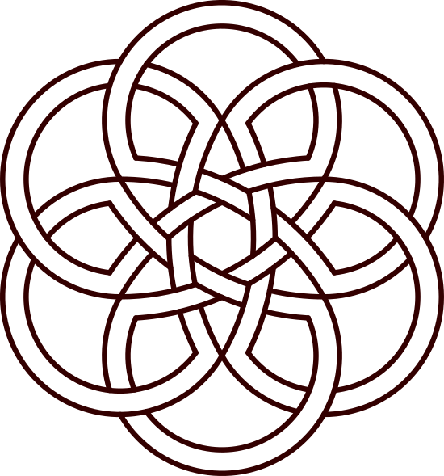
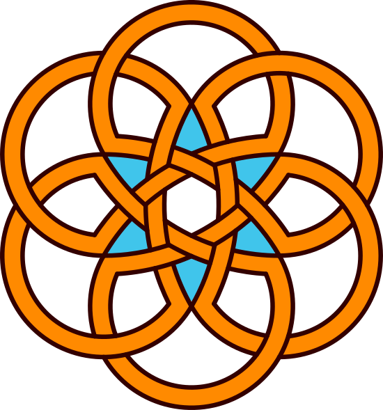

# Islamic art

Here I provide some code for the numerical creation of some basic Islamic art.
This is inspired by the #mathartchallenge by Annie Perkins Math Art Challenge:
https://arbitrarilyclose.com/ an

- Zelige (geogebra + inkscape)

[zellige.svg](svg/zellige.svg), [zellige.pdf](pdf/zellige.pdf), 
[zellige_color.svg](svg/zellige_color.svg), [zellige_color.pdf](pdf/zellige_color.pdf), 
[zelige.ggb](geogebra-export_zelige.ggb). Creations inspired by https://www.youtube.com/watch?v=hG0SuseRYds.

- Persian variations: variation on the Sultan Uljaytu's Frontispiece (inspired by https://www.instagram.com/tv/B_E4GhGgOi5/?igshid=rtzfgvl9m5b0)

[Sultan_Uljaytu_Frontispiece.svg](svg/Sultan_Uljaytu_Frontispiece.svg), 
[Sultan_Uljaytu_Frontispiece_colored.svg](svg/Sultan_Uljaytu_Frontispiece_colored.svg),

- Persian variations: design of the Sheikh Lotfallah Mosque in Ispahan, Iran (inspired by https://design.tutsplus.com/tutorials/geometric-design-the-lotfallah-mosque-dome--cms-24859)

[Lotfallah_nb.svg](svg/Lotfallah_nb.svg), 
[Lotfallah_nb.pdf](pdf/Lotfallah_nb.pdf),
[Lotfallah_colored.pdf](pdf/Lotfallah_colored.pdf),
[Lotfallah_colored.svg](svg/Lotfallah_colored.svg),
[Lotfallah_arabesque.svg](svg/Lotfallah_arabesque.svg), 
[Lotfallah_arabesque.pdf](pdf/Lotfallah_arabesque.pdf),
[Lotfallah.ggb](ggb/Lotfallah.ggb),

- Stars: Black and white version

[ten_star.png](png/ten_star.png), [ten_star.pdf](pdf/ten_star.pdf),
[ten_star.svg](svg/ten_star.svg), 

- Stars, colored with Inkscape:

- Celtic (knots) art (Arabic cousins?):

(inspired by https://design.tutsplus.com/tutorials/geometric-design-knots-and-weaves--cms-23968)

The geogebra file is available here: 
[Celting_knot_init.ggb](ggb/Celting_knot_init.ggb).

- Triskel art :

The geogebra file is available here: 
[Triskel.ggb](ggb/Triskel.ggb).
