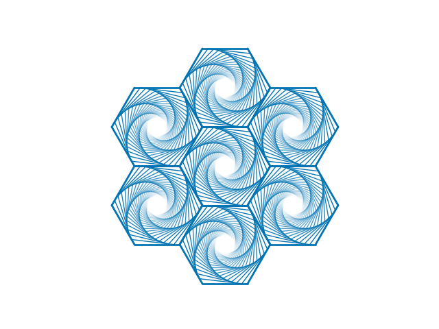

# Spline-ish

Here I provide some code for the numerical creation of splines like elements.
Some inspiration are coming from Jon Harris: https://www.youtube.com/watch?v=C2vbYpa-AWk.

and animated ones:

More on splines and Bezier curves: https://medium.com/@Acegikmo/the-ever-so-lovely-b%C3%A9zier-curve-eb27514da3bf
and 
https://www.jasondavies.com/animated-bezier/