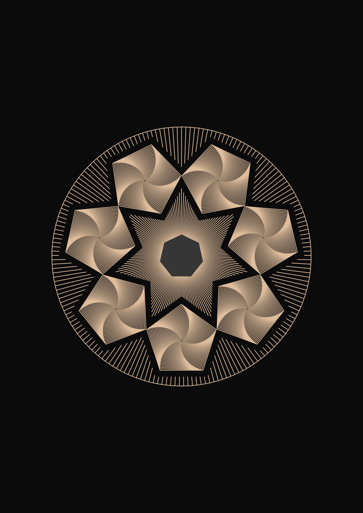

# Spline-ish

Here I provide some code for the numerical creation of splines like elements.
Some inspiration are coming from Jon Harris: <https://www.youtube.com/watch?v=C2vbYpa-AWk>.

## Images

The last one inspired by [Revdancatt](https://revdancatt.com/)
and his wonderful app:

[https://revdancatt.com/penplotter/037-Spokes-and-Circles/](https://revdancatt.com/penplotter/037-Spokes-and-Circles/?sideMargin=4&topBottomMargin=4&drawMargin=true&useMargin=false&spokes=7&spokeLength=6.7&spokeRotation=90&drawSpokes=false&circles=32&circleSegments=5&circleInnerRotation=1.5&circleRotation=0&randomCircleStart=false&outerRadius=2.9&cropRadius=3.53&drawCropRadius=false&rays=185&rayRotation=0&useRoD=false&leftMargin=3.2&topMargin=6&rightMargin=3.8&bottomMargin=6&drawRoD=false&useCoD=true&CoDx=14.85&CoDy=21&CoDSize=1.6&CoDSides=7&CoDRotation=0&CoDCropOutside=false&drawCoD=true&useCoD2=true&CoD2x=14.85&CoD2y=21&CoD2Size=10.3&CoD2Sides=90&CoD2Rotation=0&CoD2CropOutside=true&drawCoD2=true&squarify=true&layers=1&finalScale=1.03&autoRedraw=true&layout=one-up)

## Animation

More on splines and Bezier curves: <https://medium.com/@Acegikmo/the-ever-so-lovely-b%C3%A9zier-curve-eb27514da3bf>
and 
<https://www.jasondavies.com/animated-bezier/>